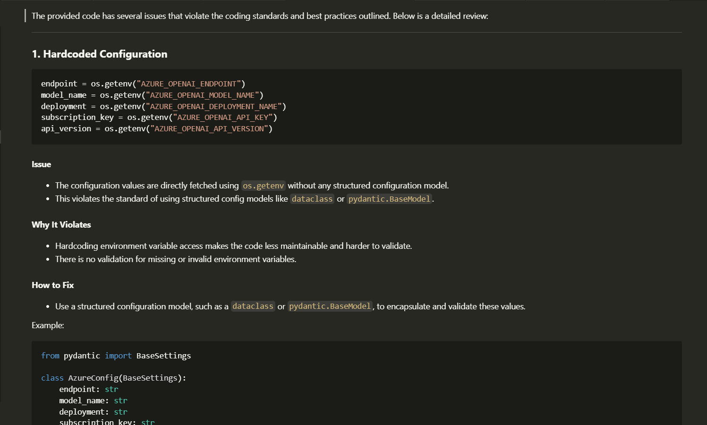

# LLM Code Commit Reviewer

Get a review of your commits for a file on your repositoy

This CLI tool helps you perform automated code reviews using Azure OpenAI by comparing a file between two Git branches and generating a review based on your team's coding standards.

---

## Features

- Compares a single file between two branches using `git diff`
- Sends the diff to an Azure OpenAI model for review
- Uses custom instructions from a local `code_review.txt` guide
- Saves the review as a Markdown file inside the `reviews/` directory
- Prompts for first-time environment setup (no manual `.env` file needed)

---

## Installation

Clone this repository and install dependencies:

```bash
git clone git@github.com:prakashgyan/llmreview.git
cd llmreview
pip install -r requirements.txt
```

Or, if packaged as a wheel:

```bash
pip install dist/llmreview-0.1.0-py3-none-any.whl
```

---

## Usage

```bash
python main.py <source_branch> <target_branch> <file_path>
llmreview <source_branch> <target_branch> <file_path>
```

Example:

```bash
python main.py feature/new-feature main src/my_module.py
llmreview feature/new-feature main src/my_module.py
```

The review will be printed in the terminal and also saved to:

```
reviews/my_module.py.md
```
### Example review

---

## First-Time Setup

On the first run, the tool will prompt you to enter your Azure OpenAI configuration. These will be saved in `.llmreviewcfg` for future runs.

You’ll be asked for:

- Azure OpenAI Endpoint
- Model Name
- Deployment Name
- API Key

---

## Review Instructions

The model uses the instructions from:

```
instructions/code_review.txt
```
Customize this file to guide the LLM on your coding standards and review expectations.

---


## Requirements

- Python 3.10+
- A valid Azure OpenAI account and deployment
- Git must be installed and available in `PATH`

---

## Project Structure

```
llmreview/
├── MANIFEST.in
├── README.md
├── pyproject.toml
├── requirements.txt
├── reviews/                      # Output folder for reviews
├── src/
│   └── llmreview/
│       ├── __init__.py            # Main CLI logic
│       ├── get_diff.py            # Git diff helper
│       ├── main.py
│       └── instructions/
│           ├── __init__.py
│           └── code_review.txt    # Review instructions for the LLM
├── .llmreviewcfg                  # Stored config (auto-generated)
```

---

## Author

PrakashGyan

---

## License

MIT License
